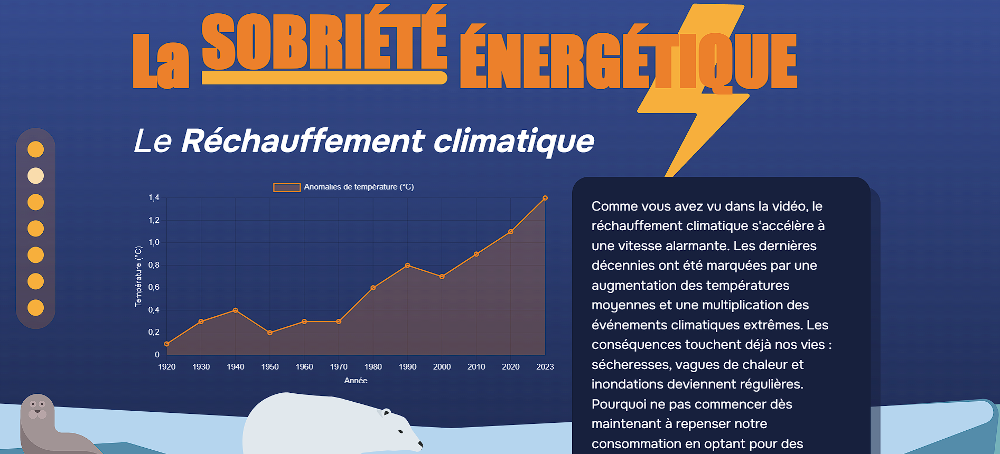

# SiteScolaire_SobrieteEnergetique
Site fictif réalisé en groupe, en 2ème de BUT MMI. Développé en HTML, CSS, JavaScript, Chart.js

Ce site est sur le sujet de la sobriété énergétique, les informations illustrés avec des graphiques sont fait sur Adobe Illustrator, ils peuvent tous être trouvé en chart.js dans le footer. 
Un quiz est disponible à la fin, développé en JavaScript. 

<a href= "https://hoffmannc.etu.mmi-unistra.fr/SAE303/">Voir le site </a>

